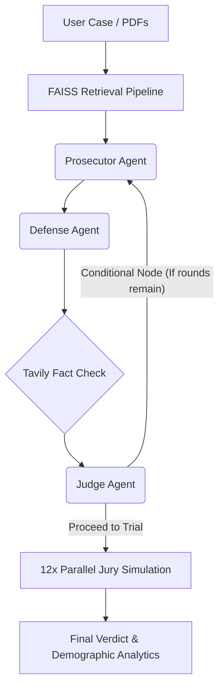

<div align="center">
  
  <h1>⚖️ CourtRoom AI</h1>
  <h3>A Multi-Agent Adversarial Legal Intelligence System</h3>

  <p align="center">
    <b>Powered by LangGraph, Groq Llama-3, Tavily Search, & FAISS Vector Search</b>
    <br/>
    <a href="#about">About</a> &bull;
    <a href="#features">Features</a> &bull;
    <a href="#architecture">Architecture</a> &bull;
    <a href="#installation">Installation</a> &bull;
    <a href="#usage">Usage</a>
  </p>
</div>

---

## 🏛️ About
**CourtRoom AI** is an advanced, fully agentic RAG (Retrieval-Augmented Generation) platform that authentically simulates a legal trial courtroom.

By supplying a case scenario (or uploading real legal documents), the system spins up multiple autonomous AI lawyers that research the topic, retrieve legal precedents, build comprehensive arguments, and actively debate one another. An AI Federal Judge evaluates the legal merit and fact-checks citations for hallucinations, before sending the case to a **Simulated 12-Person Jury**, each possessing a unique demographic profile, political lean, and background.

It serves as a powerful sandbox for predictive litigation strategy, case law stress-testing, and exploring the capabilities of adversarial multi-agent orchestration.

---

## 🔥 Features
- 🎭 **Adversarial Multi-Agent Flow:** Dynamic debate architecture. The Prosecution builds a case, and the Defense dismantles it contextually using state-machine memory tracking.
- 🗂️ **Dynamic Document Ingestion (RAG):** Upload actual trial PDFs or evidence documents. The system uses `sentence-transformers` and `FAISS` to parse, split, and embed documents for on-demand retrieval by the agents.
- 👁️ **Hallucination Detection Network:** The core problem with AI in law is fabricated citations. The Judge Agent autonomously uses the **Tavily API** to verify every single case law cited by the lawyers in real-time, flagging fabricated precedents.
- 👥 **Jury Psychology Simulation:** The final verdict isn't just an LLM guess. It spins up 12 entirely distinct parallel AI instances representing unique citizens (with varying ages, occupations, empathy scores, and media biases) who vote independently and provide emotional/demographic reasoning.
- 🛡️ **Highly Resilient Auto-Failover Protocol:** API limits hit? The system is designed for production reliability. Custom LLM wrappers intelligently default from Groq's heavy `llama-3.3-70b-versatile` down to `llama-3.1-8b-instant`, and even further down to `mixtral-8x7b-32768` instantly without crashing if rate limits are exceeded.
- 📑 **Formal Trial Transcript Exports:** Compiles the entire session (arguments, scores, final tally) out to a styled, paginated PDF format utilizing `ReportLab Platypus`.

---

## 🛠️ Architecture

Built on the cutting edge of the Agentic AI stack:
* **Orchestration:** `LangGraph` and `LangChain`
* **Models:** Groq Hardware (Llama 3 Sequence)
* **Search / External Tools:** `Tavily` Search API
* **Vector Store:** `FAISS-CPU` + MiniLM Embeddings
* **User Interface:** `Streamlit`



---

## 🚀 Installation

Ensure you have Python 3.10+ installed. Virtual environments are highly recommended via `uv` or `venv`.

```bash
# 1. Clone the repository
git clone https://github.com/yourusername/courtroomai.git
cd courtroomai

# 2. Create virtual environment and install dependencies
uv venv 
.\.venv\Scripts\activate   # (or source .venv/bin/activate on Mac/Linux)
uv pip install -r requirements.txt

# 3. Setup environment variables
cp .env.example .env
```

**Inside your `.env` file, you must include:**
```env
GROQ_API_KEY="your_groq_key_here"
TAVILY_API_KEY="your_tavily_key_here"
LANGCHAIN_API_KEY="your_langsmith_key_here" # Optional: For LangSmith Tracing
LANGCHAIN_TRACING_V2="true"
LANGCHAIN_PROJECT="courtroomai"
```

---

## 🖥️ Usage

Boot the application using Streamlit. To ensure Python module pathing works flawlessly, use python module running or `uv run`:

```bash
uv run streamlit run ui/app.py
```

### Loading Sample Cases
If you don't have a case to type out, simply use the sidebar dropdown to load one of the built-in simulations:
- **Insider Trading**
- **Corporate Fraud** (Theranos-style)
- **IP Theft & Trade Secrets** (LiDAR technology espionage)

Once the run completes, download your generated **PDF Trial Transcript** straight from the UI!

---

<p align="center">
  <i>Developed for exploring the boundaries of Legal AI and Multi-Agent interactions. Not intended for actual legal advice or judicial replacement.</i>
</p>
